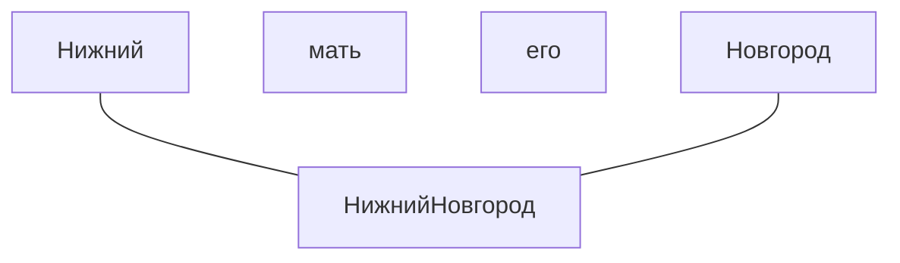
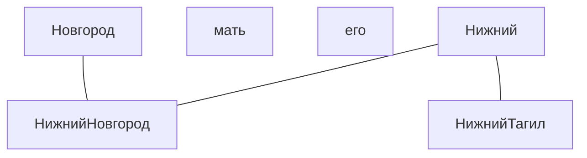
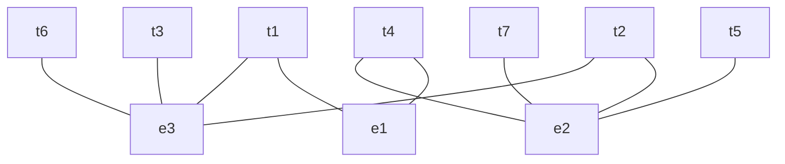
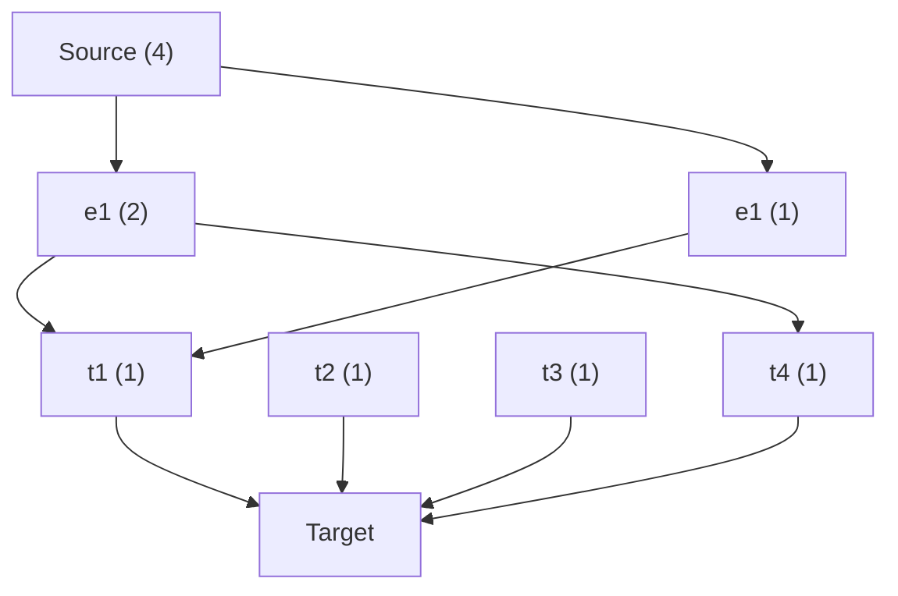

Решая задачу распознавания именованных сущностей (NER) столкнулся с такой штукой - для morphologically rich (синтетических) языков свойственен почти случайный порядок слов  в предложении.  
При этом задачу NER решают обычно на датасетах с разметкой IOB (Begin, Inner, Out), учитывающую последовательность токенов. Например в тексте "Нижний Новгород, мать его." будут такие теги - `B-LOC, I-LOC, O, O` ( Начало Location, продолжение Location и 2 слова без меток). Но мы, носители великого и могучего, можем запросто сказать так: "Нижний, мать его, Новгород" и модель, обученная на таком датасете, выдаст `B-LOC, O, O, B-LOC`. Чтобы собрать Сущность НижнийНовгород, нужно придумать еще один слой, который соберет эти 2 "начала" в одну "цепочку".  
Как-то так это можно представить графически:  

А ещё у нас могут быть какие-то другие сущности, например НижнийТагил:  

И конечно же может случиться так что токены сущностей разбиты не только незначимыми токенами (O), но и токенами, являющимися упоминанием других сущностей. Как-то так:  

Конечно на практике такой текст представить сложно, но такое запросто может случиться.  
Продолжаем. При чем здесь поток (в заголовке)? Добавим направление в наш граф, 2 ноды `Source` и `Target` и представим, что из `Source` в `Target`, через вершины типа `E` и `T`, течет поток (молочные реки к кисельным берегам сильного ИИ). Ограничим количество потока, вытекающего из `Source` количеством вершин типа `T`. В скобках на графе указано количество вытекающего потока из ноды:  

Выбирая между `e1` и `e2` берем ту вершину, через которую из `Source` в `Target` может протечь максимальное количество потока.  
Конечно не так всё просто, детали я опишу в другой статье. Важно что этот подход позволяет добавить к выбору нод типа `E` еще и информацию о семантических отношениях сущностей, но это совсем другая история.  

