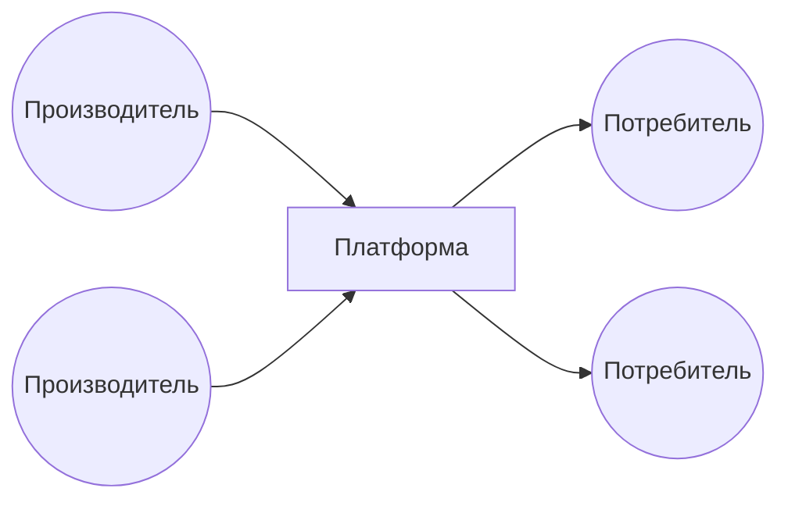
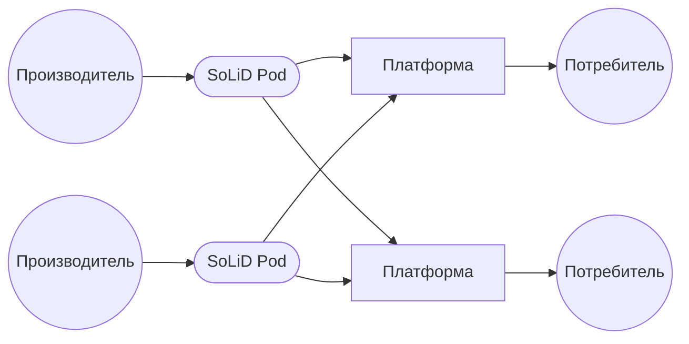

Для тех кто не знаком, [SoLiD](https://solidproject.org) (Social Linked Data) - логичное продолжение идей Linked Data, Semantic Web и вот этого всего от Сэра Тима Бернерса-Ли.  
Идея простая - у вас есть какой-то личный контент, вы ставите SoLiD сервер (pod) и раздаете этот контент с ограничением прав доступа (выбранным людям/приложениям). Формат данных унифицирован (RDF) и потребителям вашего контента не нужно изучать спецификацию API (ограниченную только вашей фантазией).  
Недавно познакомился с группой энтузиастов, которые пришли к подобной идее с другой стороны. Видео по ссылке - [что такое Пост-Платформы и зачем они нужны?](https://youtu.be/vAwPeXv46ZY).  
Разберу, что это такое и зачем это может быть нужно вам.  
**Физические лица и их некоммерческие интересы.** Допустим, у вас есть какие-то посты в соц.сетях (Facebook, Instagram и т.п.), сейчас эти публикации хранятся на серверах соц.сетей, доступ к ним разграничен средствами платформы (соц.сети в  данном случае). Уйти от одной соц.сети к другой, и перенести весь свой контент, сложно (конечно еще важна посещаемость и удобство площадки, но тут в фокусе только контент). Так же вам, возможно, сложно переносить переписку между мессенджерами, документы между облачными редакторами, плейлисты между стриминговыми (кино, музыка) сервисами, ачивки и сохранения между игровыми платформами ну и так далее. Надеюсь, идея понятна - ваши данные должны принадлежать вам, куда хотите, туда с ними и уходите.  
**Компании и их коммерческий интерес.** Допустим, вы продаете товары на маркетплейсах (Wildberries, Ozon, Яндекс.Маркет), или у вас отель и вы продаете номера через Booking. Тут ситуация такая же - есть платформа, которая диктует свои условия, берет какую-то комиссию и переход между платформами - тот еще баттхерт. Для простоты рассмотрим отель, основные продажи которого идут через агрегатора (платформу, Booking). Платформы прошли долгий сложный путь интеграции с учетными системами и стали жирным слоем между нашим маленьким отелем и потребителем. Запустить свою новую платформу сложно, долго, дорого - конкуренции почти нет. Для отеля это подразумевает игру по правилам платформы, для платформы - возможность снимать сливки и собирать максимальную комиссию. Для нас с вами (потребителей) - высокую цену, включающую комиссии платформ.  
**А что, если...** каждый такой поставщик товаров и услуг, зависящий от платформ, поставит себе SoLiD-сервер и выложит информацию о своих товарах/услугах в унифицированном (привет, Semantic Web) виде? 
**Сейчас этот процесс выглядит так:**  
Производитель контента (отель, или мы с фотками в Instagram) отдаете контент Платформе, Потребитель потребляет контент на Платформе.  
  

**А может выглядеть так:**  
Производитель публикует контент на своем SoLiD поде, любая Платформа получает данные из Пода, а для Потребителя ничего не меняется (за исключением роста зоопарка платформ).  
  

Открытая информация позволит проще запускать платформы (хочешь стартап - делай платформу), производители увеличат количество каналов сбыта, комиссии снизятся. Производители экономят на комиссиях, потребители получают низкую цену и более специализированные площадки. Платформы теряют рынок.  
Миллион вопросов конечно же. Посмотрим, что будет дальше.

