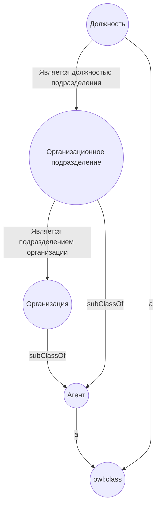

Конфиг Docker для [Apache Jena Fuseki](https://jena.apache.org/documentation/fuseki2/).  
Не нашел внятного конфига для своих задачек и написал сам, может кому-то тоже пригодится.  
Ссылка на репозиторий - [github](https://github.com/cnstntn-kndrtv/fuseki-docker-config)  
  
Добавлено немного данных для примера.  
Содержит простой граф:  



И немного транзитивных правил:  
```sparql
# Если у `А` есть подкласс `Х`, а у `Х` есть подкласс `У`, то `У` - так же подкласс `А`
[transit_sc:  (?x rdfs:subClassOf ?y), (?a rdfs:subClassOf ?x)
               -> (?a rdfs:subClassOf ?y)]

# Если `Х` имеет тип `А`, у `У` является подклассом `Х`, то `У` тоже имеет тип `А`
[transit_type:  (?x rdfs:subClassOf ?y), (?a rdf:type ?x)
                -> (?a rdf:type ?y)]

# ну и так далее (догадайтесь сами)
[transit_p_range:  (?p rdfs:range ?c), (?sc rdfs:subClassOf ?c)
                    -> (?p rdfs:range ?sc)]
[transit_p_domain:  (?p rdfs:domain ?c), (?sc rdfs:subClassOf ?c)
                    -> (?p rdfs:domain ?sc)]
```
